<!--
  vuav — GitHub profile README
  Repo: github.com/vuav/vuav  (repo name must match the username)
  Assets live in /assets and are plain SVG. Edit the SVGs, not this file,
  when you want to change wording inside a card.
-->

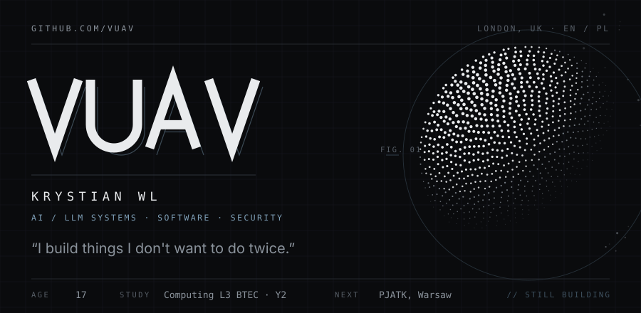

  
  
  

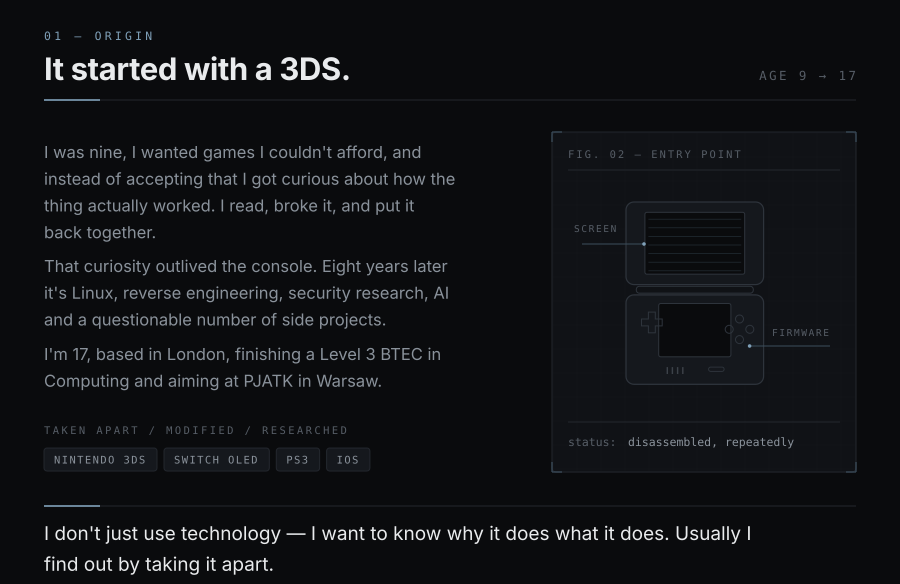

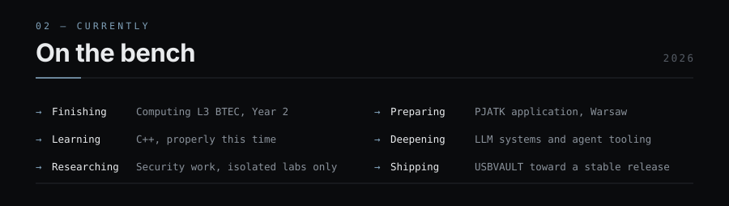

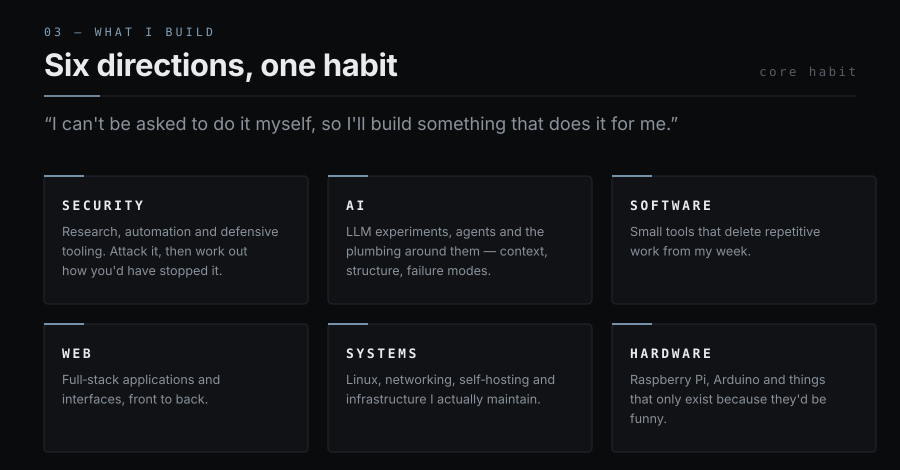

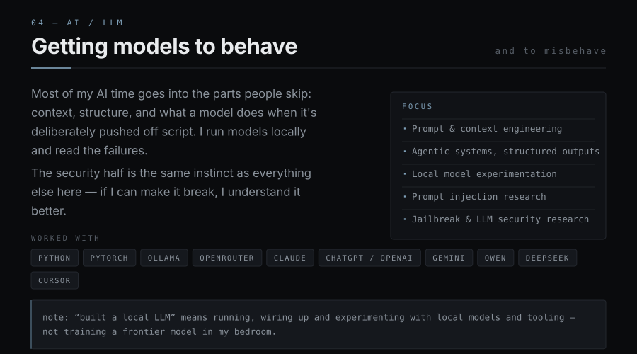

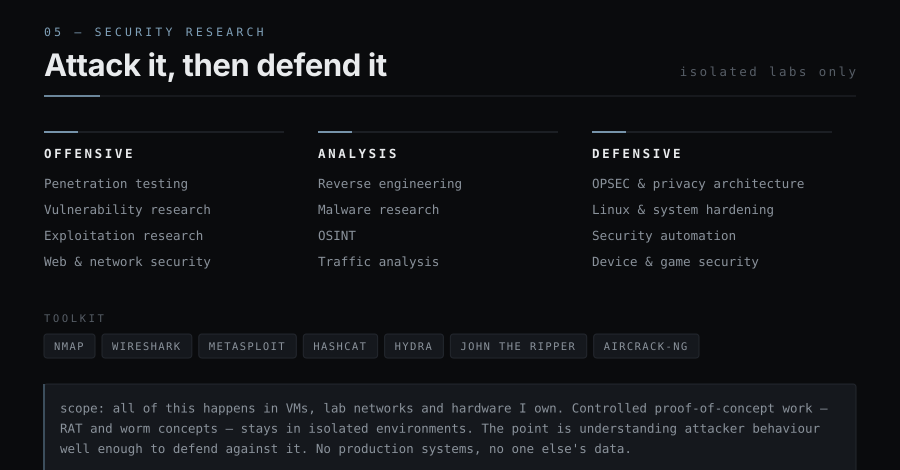

<!-- PROJECT LINKS: each card is wrapped in an <a>. Swap the href for the real repo URL once it's public. -->

<a href="https://github.com/vuav?tab=repositories">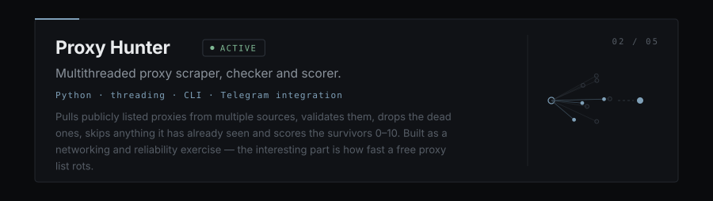</a>

<a href="https://github.com/vuav?tab=repositories">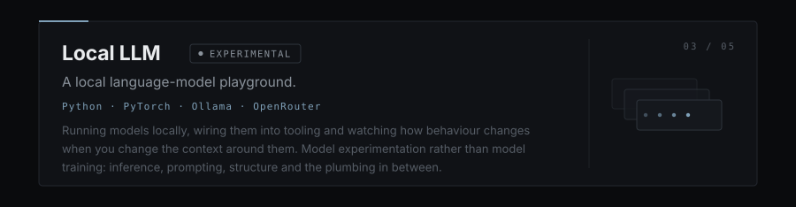</a>

<a href="https://github.com/vuav?tab=repositories">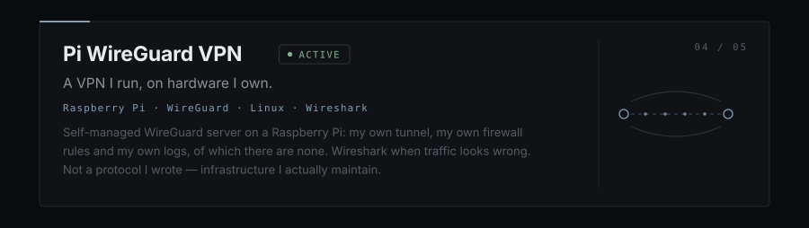</a>

<a href="https://github.com/vuav?tab=repositories">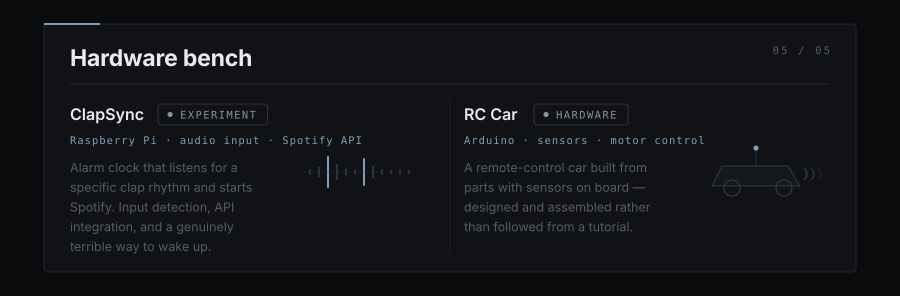</a>

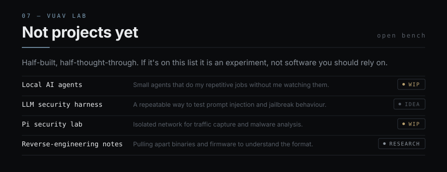

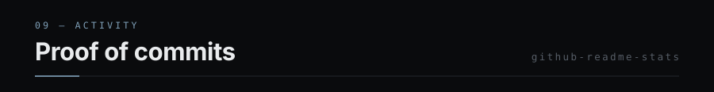

  
  

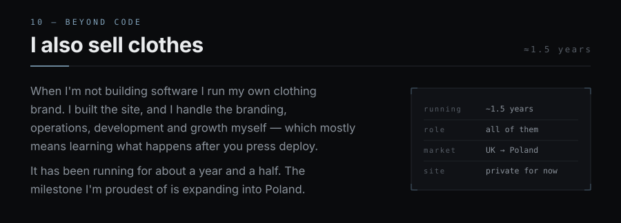

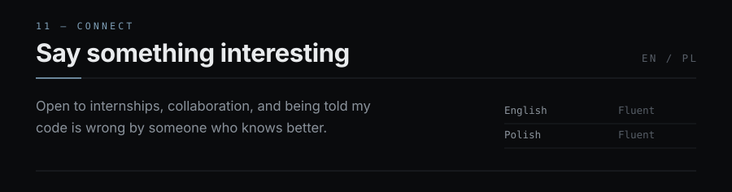

  <a href="https://github.com/vuav">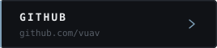</a>
  <a href="https://linkedin.com/in/krystianwlos">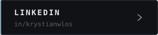</a>
  <a href="mailto:krystianwlos@proton.me">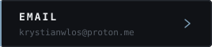</a>
  <!-- RESUME: when you have one, drop resume.pdf in /assets and uncomment the line below.
  <a href="assets/resume.pdf">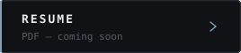</a>
  -->

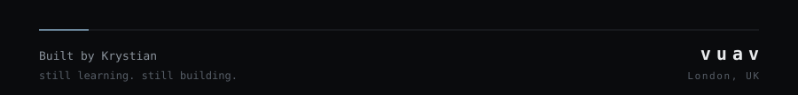

Plain-text version of this profile

## vuav — Krystian Wl

Software engineering · AI · Security · Systems. 17, London, UK. English and Polish, both fluent.
Computing Level 3 BTEC (Year 2), aiming at PJATK in Warsaw.
**"I build things I don't want to do twice."**

### Origin
It started with a 3DS. I was nine, I wanted games I couldn't afford, and instead of accepting that I got curious about how the thing actually worked. I read, broke it, and put it back together. That curiosity outlived the console: Linux, reverse engineering, security research, AI, and a questionable number of side projects. Taken apart / modified / researched: Nintendo 3DS, Switch OLED, PS3, iOS.

### Currently
Finishing Computing L3 BTEC (Year 2) · preparing a PJATK application · learning C++ · going deeper into LLM systems and agent tooling · security research in isolated labs only · shipping USBVAULT toward a stable release.

### AI / LLM
Prompt and context engineering, agentic systems, structured outputs, local model experimentation, prompt injection and jailbreak research. Worked with Python, PyTorch, Ollama, OpenRouter, Claude, ChatGPT/OpenAI, Gemini, Qwen, DeepSeek, Cursor. "Built a local LLM" means running, wiring up and experimenting with local models and tooling — not training a frontier model in my bedroom.

### Security research
Offensive: penetration testing, vulnerability research, exploitation research, web and network security. Analysis: reverse engineering, malware research, OSINT, traffic analysis. Defensive: OPSEC and privacy architecture, Linux and system hardening, security automation, device and game security. Toolkit: Nmap, Wireshark, Metasploit, Hashcat, Hydra, John the Ripper, Aircrack-ng. All of it happens in VMs, lab networks and hardware I own; controlled proof-of-concept work stays in isolated environments. No production systems, no one else's data.

### Projects
- **USBVAULT** *(alpha, Python)* — per-file authenticated encryption for USB drives. Argon2id → KEK → DEK → HKDF-SHA256 → per-file keys → ChaCha20-Poly1305, 256 KB chunks. Printable one-time recovery sheet with optional 3-of-5 Shamir shares. No backdoor, no reset, no artificial lockout. Counterfeit-capacity detection, drive fingerprint binding, wear tracking, safe eject, GUI + CLI, tray agent, portable unlocker, Windows + Linux, no account, no telemetry. **Alpha, not independently audited — for data you cannot afford to lose, use a mature, audited tool.**
- **Proxy Hunter** *(active, Python)* — multithreaded CLI proxy scraper, checker and scorer with optional Telegram integration.
- **Local LLM** *(experimental)* — local language-model playground: PyTorch, Ollama, OpenRouter.
- **Pi WireGuard VPN** *(active)* — self-managed WireGuard server on a Raspberry Pi; Wireshark for traffic analysis.
- **ClapSync** *(experiment)* — alarm clock that detects a clap rhythm and starts Spotify.
- **RC Car** *(hardware)* — remote-control car built from parts with sensors, designed rather than followed.

### vuav lab (experiments, not finished software)
Local AI agents (WIP) · LLM security harness (idea) · Pi security lab (WIP) · reverse-engineering notes (research).

### Stack
AI: Python, PyTorch, Ollama, OpenRouter, Cursor · Languages: Python, JavaScript, HTML, CSS, C++ (learning) · Frontend: React, Tailwind · Backend: Node.js, Flask · Data: SQLite, Redis · Infra: Docker, AWS, Cloudflare, WireGuard, SSH · Security: Nmap, Wireshark, Metasploit, Hashcat, Hydra, John the Ripper, Aircrack-ng · Systems: Debian, Parrot OS, Qubes OS, WSL, VirtualBox · Hardware: Raspberry Pi, Arduino · Tools: Git, GitHub, VS Code.

### Beyond code
I run my own clothing brand — around a year and a half, site built by me, branding, operations, development and growth handled myself. It expanded into Poland.

### Connect
GitHub: [github.com/vuav](https://github.com/vuav) · LinkedIn: [in/krystianwlos](https://linkedin.com/in/krystianwlos) · Email: [krystianwlos@proton.me](mailto:krystianwlos@proton.me)

