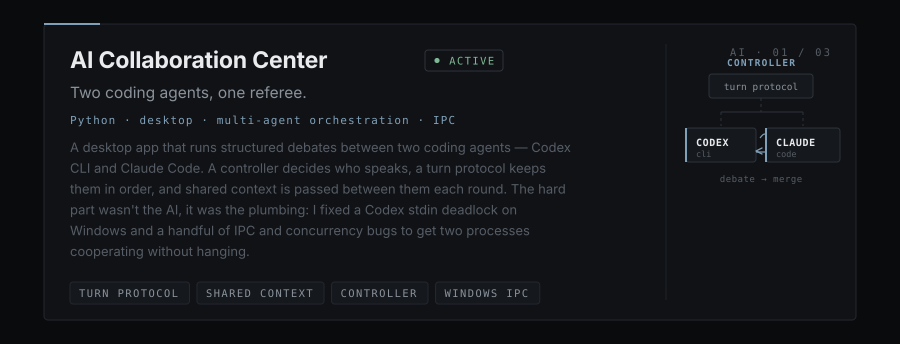
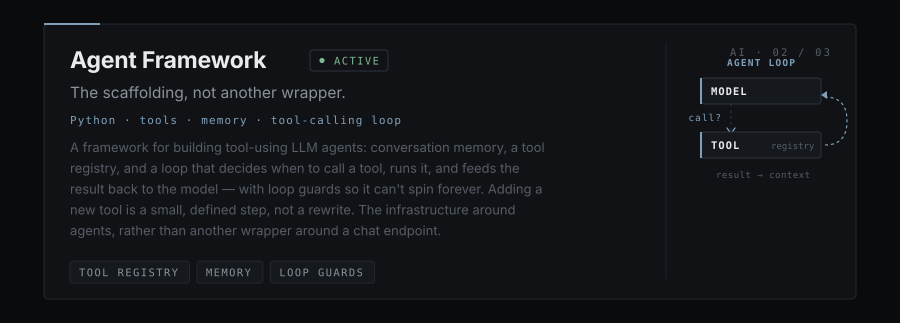
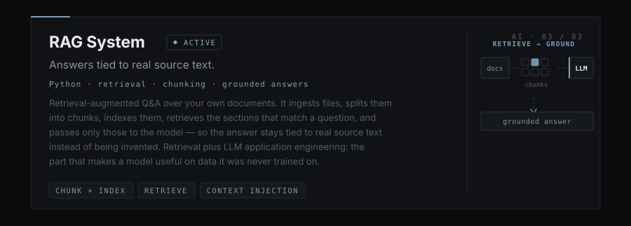

<!--
  vuav/vuav — profile README (AI-forward build, original visual system preserved)
  All section SVGs are Krystian's own, unchanged, except hero.svg (role line now
  leads with AI). Three NEW cards were added in the same compact-card grammar:
    assets/projects/ai-collaboration-center.svg
    assets/projects/agent-framework.svg
    assets/projects/rag.svg
  These three repos are private-pending-publish, so their cards link to the
  profile root for now. Swap each to its real repo URL once public:
    AI Collaboration Center -> https://github.com/vuav/<repo>
    Agent Framework         -> https://github.com/vuav/<repo>
    RAG System              -> https://github.com/vuav/<repo>
-->

<!-- swap to real repo when public -->

<b>Plain-text version</b>

## vuav — Krystian Wł
**AI / LLM systems · software · security · systems.** 17, London, UK. English and Polish, both fluent. Computing L3 BTEC (Year 2), heading for PJATK in Warsaw. **"I build things I don't want to do twice."**

### 01 — Origin
It started with a 3DS. At nine I wanted games I couldn't afford, got curious about how it worked, read it, broke it, put it back together. Eight years later it's Linux, reverse engineering, security, systems and AI. Taken apart / modified / researched: 3DS, Switch OLED, PS3, iOS.

### 04 — AI / LLM
Most of my AI time goes into the parts people skip: context, structure, and what a model does when pushed off script. Prompt and context engineering, agentic systems, structured outputs, local inference, prompt injection and jailbreak/LLM security research. Python, PyTorch, Ollama, OpenRouter, Claude, ChatGPT/OpenAI, Gemini, Qwen, DeepSeek, Cursor. *"Local LLM" means running and wiring up local models — not training a frontier model in my bedroom.*

**AI systems I've built** *(repos publishing soon)*
- **AI Collaboration Center** *(active, Python)* — desktop app running structured debates between Codex CLI and Claude Code: controller, turn protocol, shared context. Fixed a Codex stdin deadlock on Windows plus IPC/concurrency bugs. Multi-agent orchestration + systems engineering.
- **Agent Framework** *(active, Python)* — tool-using LLM agents: memory, tool registry, and a tool-calling loop with loop guards. Adding a tool is a small, defined step.
- **RAG System** *(active, Python)* — retrieval-augmented Q&A: ingest → chunk/index → retrieve → pass to the model → grounded answer.

### 06 — Featured projects
- **USBVAULT** *(alpha, Python, flagship)* — per-file authenticated encryption for USB drives. Argon2id → KEK → DEK → HKDF-SHA256 → per-file keys → ChaCha20-Poly1305, 256 KB chunks. Printable one-time recovery sheet with optional 3-of-5 Shamir shares. No backdoor, no reset, no lockout. Counterfeit-capacity detection, drive fingerprint binding, wear tracking, GUI + CLI, Windows + Linux, no account, no telemetry. **Alpha, not independently audited — for data you cannot afford to lose, use a mature, audited tool.**
- **Proxy Hunter** *(active, Python)* — multithreaded proxy scraper/checker/scorer, Telegram integration.
- **Local LLM** *(experimental)* — local inference playground: PyTorch, Ollama, OpenRouter.
- **Pi WireGuard VPN** *(active)* — self-managed WireGuard on a Raspberry Pi; Wireshark for traffic analysis.
- **Hardware bench** *(experiment)* — ClapSync (clap-rhythm alarm → Spotify), RC car built from parts.

### 05 — Security research
Attack it, then defend it. Offensive: pentest, vuln/exploitation research, web/network security. Analysis: reverse engineering, malware research, OSINT, traffic analysis. Defensive: OPSEC, hardening, automation. Nmap, Wireshark, Metasploit, Hashcat, Hydra, John the Ripper, Aircrack-ng. Isolated labs only.

### 08 — Stack (honest levels)
AI: Python (primary), PyTorch (learning), Ollama/OpenRouter/Cursor (comfortable) · Languages: Python/HTML/CSS (primary), JavaScript (comfortable), C++ (learning) · Frontend: React, Tailwind · Backend: Node.js, Flask · Data: SQLite (comfortable), Redis (learning) · Infra: Docker, Cloudflare, WireGuard (comfortable), SSH (primary), AWS (learning) · Systems: Debian/WSL (primary), Parrot OS/VirtualBox (comfortable), Qubes OS (learning) · Security: Nmap, Wireshark, Metasploit, Hashcat, Hydra, John the Ripper, Aircrack-ng · Hardware: Raspberry Pi, Arduino, ESP32 · Tools: Git, GitHub, VS Code.

### 10 — Beyond code
My own clothing brand — ~1.5 years, site built by me, branding/operations/development/growth handled myself. Expanded into Poland.

### 11 — Connect
GitHub [github.com/vuav](https://github.com/vuav) · LinkedIn [in/krystianwlos](https://linkedin.com/in/krystianwlos) · Email <krystianwlos@proton.me>

