<!-- ░░ vuav profile — banner is a self-contained animated SVG in this repo ░░ -->



<div align="center">

[](#)
[](#)
[](#)
[](#)
[](#)

</div>

---

### `$ ./whoami`

```text
vuav@sys:~$ nmap -sV --script=identity vuav
Starting scan against target: vuav
Host is up (0.00013s latency).

PORT      STATE   SERVICE     VERSION
22/tcp    open    ssh         cybersecurity student — audits over assumptions
443/tcp   open    https       building USBVAULT — encrypted vault engine (C++)
1337/tcp  open    ctf         reverse-engineering · detection eng · red + blue
8080/tcp  open    http        stack: C++ · Python · TypeScript · C
5432/tcp  open    postgres    principle: don't trust it — audit it, then publish

Scan complete. 1 host up. No vulnerabilities... that I'll admit to.
```

---

## `// active operations`

| operation | brief | stack | status |
|---|---|---|---|
| **USBVAULT** | Open-source encrypted USB vault engine — per-file XChaCha20-Poly1305, Argon2id KEK→wrapped-DEK, multi-slot unlock (FIDO2 · TPM · recovery). Built to be *audited*, not trusted. | `C++` `WinFsp/FUSE` | 🔴 in progress |
| **honeytrace** | Self-hosted SSH/HTTP honeypot with a live public dashboard of real intrusion attempts. Attacker data you can't fake. | `C++` `Postgres` | 🟠 planned |
| **runecipher** | Substitution/rune cipher toolkit + the gate powering the puzzle at the bottom of this page. | `Python` | 🟢 live |
| **loadtrace** | Async HTTP load generator with latency-percentile reporting and a local-only guardrail — the attack half of an attack-then-defend loop. | `Python` `aiohttp` | 🟢 live |

> Repos flip public as each threat model + spec lands. Watch this space.

---

## `// live threat feed`

Actively-exploited vulnerabilities, pulled daily from the CISA KEV catalog by a GitHub Action — this section rewrites itself.

<!-- KEV-START -->
```text
awaiting first sync — the threat-feed workflow populates this within 24h
```
<!-- KEV-END -->

---

## `// signal`

<div align="center">


</div>

<!-- the snake is generated by the snake workflow and pushed to the `output` branch -->


---

## `// cipher gate`

Decode the sigil string. Solve it and you're etched into the Hall of Fame — automatically, by the bot that judges every attempt.

```text
ᛟ ᛒ ᛊ ᛁ ᛞ ᛁ ᚨ ᚾ
```

**legend** — `ᛟ`=o `ᛒ`=b `ᛊ`=s `ᛁ`=i `ᛞ`=d `ᚨ`=a `ᚾ`=n

**to submit:** [open an issue](../../issues/new?title=solve:%20YOURANSWER&body=decoded%20by%20me) titled exactly `solve: <your answer>`. The gate replies, records, and seals it within seconds.

### 🏛️ hall of fame
<!-- HOF-START -->
_no one has passed the gate yet. be the first._
<!-- HOF-END -->

---

<div align="center">
<sub><code>vuav@sys:~$ logout</code> — audit it, don't trust it.</sub>
</div>
